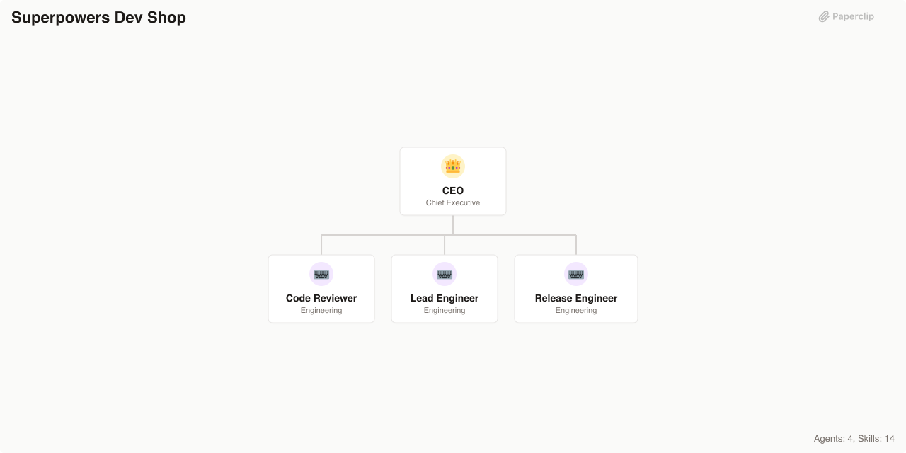

# Superpowers Dev Shop

> A disciplined software development company powered by the Superpowers workflow — brainstorm, plan, build with TDD, review, and ship

> An [Agent Company](https://agentcompanies.io) based on [Superpowers](https://github.com/obra/superpowers) — an opinionated dev process with TDD, debugging, code review, git worktrees, and verification skills



## What's Inside

> This is an [Agent Company](https://agentcompanies.io) package from [Paperclip](https://paperclip.ing)

| Content | Count |
|---------|-------|
| Agents | 4 |
| Skills | 14 |

### Agents

| Agent | Role | Reports To |
|-------|------|------------|
| CEO | CEO | — |
| Code Reviewer | Engineer | ceo |
| Lead Engineer | Engineer | ceo |
| Release Engineer | Engineer | ceo |

### Skills

| Skill | Description | Source |
|-------|-------------|--------|
| brainstorming | Explores user intent, requirements and design before implementation. Use before any creative work — creating features, building components, adding functionality, or modifying behavior. | [github](https://github.com/obra/superpowers/blob/main/skills/brainstorming/SKILL.md) |
| dispatching-parallel-agents | Use when facing 2+ independent tasks that can be worked on without shared state or sequential dependencies | [github](https://github.com/obra/superpowers/blob/main/skills/dispatching-parallel-agents/SKILL.md) |
| executing-plans | Use when you have a written implementation plan to execute in a separate session with review checkpoints | [github](https://github.com/obra/superpowers/blob/main/skills/executing-plans/SKILL.md) |
| finishing-a-development-branch | Use when implementation is complete, all tests pass, and you need to decide how to integrate the work — guides completion of development work by presenting structured options for merge, PR, or cleanup | [github](https://github.com/obra/superpowers/blob/main/skills/finishing-a-development-branch/SKILL.md) |
| receiving-code-review | Use when receiving code review feedback, before implementing suggestions, especially if feedback seems unclear or technically questionable — requires technical rigor and verification, not performative agreement or blind implementation | [github](https://github.com/obra/superpowers/blob/main/skills/receiving-code-review/SKILL.md) |
| requesting-code-review | Use when completing tasks, implementing major features, or before merging to verify work meets requirements | [github](https://github.com/obra/superpowers/blob/main/skills/requesting-code-review/SKILL.md) |
| subagent-driven-development | Use when executing implementation plans with independent tasks in the current session | [github](https://github.com/obra/superpowers/blob/main/skills/subagent-driven-development/SKILL.md) |
| systematic-debugging | Use when encountering any bug, test failure, or unexpected behavior, before proposing fixes | [github](https://github.com/obra/superpowers/blob/main/skills/systematic-debugging/SKILL.md) |
| test-driven-development | Use when implementing any feature or bugfix, before writing implementation code | [github](https://github.com/obra/superpowers/blob/main/skills/test-driven-development/SKILL.md) |
| using-git-worktrees | Use when starting feature work that needs isolation from current workspace or before executing implementation plans — creates isolated git worktrees with smart directory selection and safety verification | [github](https://github.com/obra/superpowers/blob/main/skills/using-git-worktrees/SKILL.md) |
| using-superpowers | Use when starting any conversation — establishes how to find and use skills, requiring Skill tool invocation before ANY response including clarifying questions | [github](https://github.com/obra/superpowers/blob/main/skills/using-superpowers/SKILL.md) |
| verification-before-completion | Use when about to claim work is complete, fixed, or passing, before committing or creating PRs — requires running verification commands and confirming output before making any success claims; evidence before assertions always | [github](https://github.com/obra/superpowers/blob/main/skills/verification-before-completion/SKILL.md) |
| writing-plans | Use when you have a spec or requirements for a multi-step task, before touching code | [github](https://github.com/obra/superpowers/blob/main/skills/writing-plans/SKILL.md) |
| writing-skills | Use when creating new skills, editing existing skills, or verifying skills work before deployment | [github](https://github.com/obra/superpowers/blob/main/skills/writing-skills/SKILL.md) |

## Getting Started

```bash
npx paperclipai company import this-github-url-or-folder
```

See [Paperclip](https://paperclip.ing) for more information.

---
Exported from [Paperclip](https://paperclip.ing) on 2026-03-23
